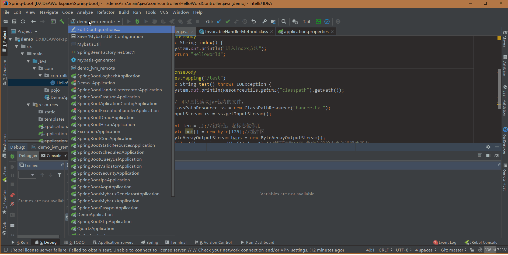
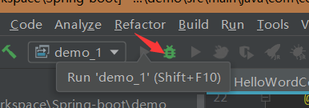

### IDEA远程debug

1、在IntelliJ IDEA的run/debug configuration中增加一个remote类型的配置




2、以以下方式来启动 Jar包

```shell
java -Xdebug -Xrunjdwp:transport=dt_socket,address=5005,server=y,suspend=y -jar demo-0.0.1-SNAPSHOT.jar
```

3、启动之后，你会发现，有如下提示：

```shell
Listening for transport dt_socket at address: 5005
```

4、这个时候，就卡在这不动了，我们回到IntelliJ IDEA，点击调试按钮。这个时候，就可以进行断点调试了。

（ps：启动应用是卡着，点击debug后才能启动应用完成！）



