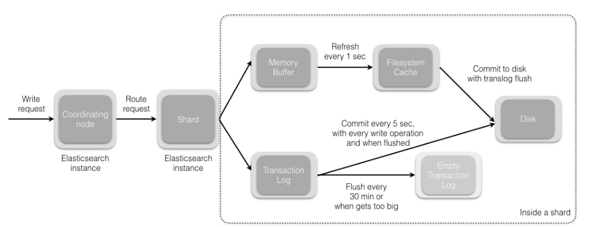

#### 对应于关系数据库术语

```shell
Elasticsearch Index == Database 
Types == Tables 
Properties == Schema
```

Elasticsearch集群可以包含多个索引(indices)（数据库），每一个索引可以包含多个类型(types)（表），每一个类型包含多个文档(documents)（行），然后每个文档包含多个字段(Fields)（列）。

#### 集群

集群：一个集群(cluster)由一个或多个节点组成，它们具有相同的cluster.name，会感知和平衡数据，有一个主节点（选举）
节点：每个es实例
分片：保存索引的一部分数据，
	主要分片：index的一部分,默认分配5个。
	复制分片：备份主要分片，可以调整数目。
	当索引创建完成的时候，主分片的数量就固定了，但是复制分片的数量可以随时调整。

#### 集群健康

- green	所有主要分片和复制分片都可用
- yellow	所有主要分片可用，但不是所有复制分片都可用
- red	不是所有的主要分片都可用

主分片和备分片不会出现在同一个节点上,如果你只有一个节点，那么5个replica都无法分配（unassigned）。所以单节点健康状态肯定是yellow。

#### 节点

- 主节点：设定配置文件 elasticsearch.yml 中的node.master属性为true(默认) 成为主节点
- 数据节点：node.data属性为true(默认) 成为数据节点。如果我们要使用一个专门的主节点，应将其node.data属性设置为false。
- 客户端节点（协调节点）：如果我们将node.master属性和node.data属性都设置为false，那么该节点就是一个客户端节点，扮演一个负载均衡的角色，将到来的请求路由到集群中的各个节点。

#### 新增数据

1. Elasticsearch 集群中的每个节点都包含了改节点上分片的元数据信息。协调节点 (默认) 使用文档 ID 参与计算，以便为路由提供合适的分片。Elasticsearch 使用MurMurHash3函数对文档 ID 进行哈希，其结果再对分片数量取模，得到的结果即是索引文档的分片。（`计算分片`）

   ```java
   shard = hash(document_id) % (num_of_primary_shards)
   ```

2. ​当分片所在的节点接收到来自协调节点的请求后，会将该请求写入 translog(我们将在本系列接下来的文章中讲到)，并将文档`加入内存缓冲`。如果请求在主分片上成功处理，该请求会并行发送到该分片的副本上。当 translog 被同步 (fsync) 到全部的主分片及其副本上后，客户端才会收到确认通知。

3. `​内存缓冲会被周期性刷新` (默认是 1 秒)，内容将被写到文件系统缓存的一个新段上。虽然这个段并没有被同步 (fsync)，但它是开放的，内容**可以被搜索到**。

4. 每 30 分钟，或者当 translog 很大的时候，translog 会被清空，文件系统缓存会被同步。这个过程在 Elasticsearch 中称为冲洗 (flush)。在冲洗过程中，内存中的缓冲将被清除，内容被写入一个新段。段的 fsync 将创建一个新的提交点，并将`内容刷新到磁盘`。旧的 translog 将被删除并开始一个新的 translog。



