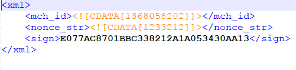

### linux常用命令：

###### 远程下载文件：`wget`

```shell
wget [url] -P [下载目录]
```

###### post发送xml

```shell
curl -X POST -H 'Content-type:application/xml' -d @/tmp/data.xml https://apitest.mch.weixin.qq.com/sandboxnew/pay/getsignkey
```

-d :--data参数后面 @为路径
-X :指定什么类型请求get/post/put。。。
-H :--hearder增加头信息 



###### post发送json

```shell
curl -i -X POST -H 'Content-type':'application/json' -d '{json}' http://wx.sp-hicard.com/publicCount/menu/messageNotify
```

###### 两个主机传输文件(需要密码)scp

```shell
scp -P 22 -r tomcat7 root@192.168.1.110:/home
```

两个机器都要支持scp命令
-P是 对面机器的ssh端口
-r是目录 
root对方用户@ip:/目录
其实不管文件或者目录加 -r 都可以

###### md5sum 

生成md5字符串，比较内容的

###### 查看负载

`w`、`uptime`、`top`

top -i 实时显示进程
top
    P：按%CPU使用率排行
　T：按MITE+排行
　M：按%MEM排行

###### 查看机器几核

```shell
cat /proc/cpuinfo |grep "cores"|uniq
```

###### 查看内存

free -m

free -g

###### 查看文件大小

> du -sh *


###### 同步系统时间

> yum install ntpdate
> ntpdate -u ntp.api.bz  上海时间

