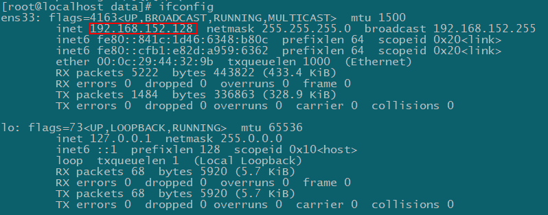
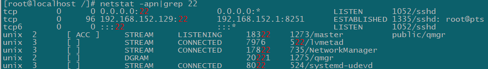
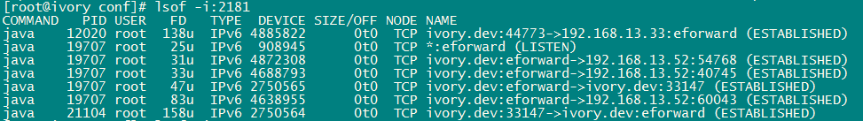

### 查看网络、端口命令

###### 1.查看ip信息`ifconfig`



###### 2.查看端口

```shell
netstat -apn|grep 22
```



###### 3.列出所有处于监听状态的tcp端口`LISTEN`

```shell
netstat -lt
```

查看所有的端口信息, 包括 PID 和进程名称

```shell
netstat -tulpn
```

-a  all
-l  linsten
-n  显示ip地址
-p  程序名字programs
-u udp
-t tcp

###### 4.查询连接情况

```shell
lsof -i:2181
```
- -i<条件> 列出符合条件的进程。（4、6、协议、:端口、 @ip ）




