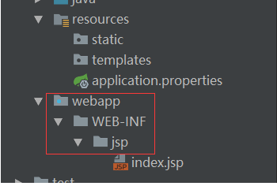
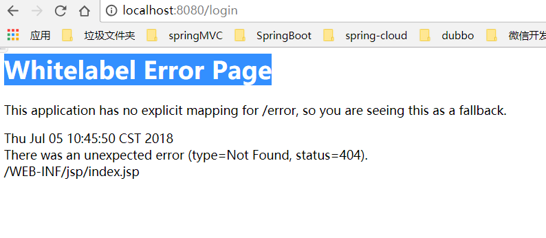
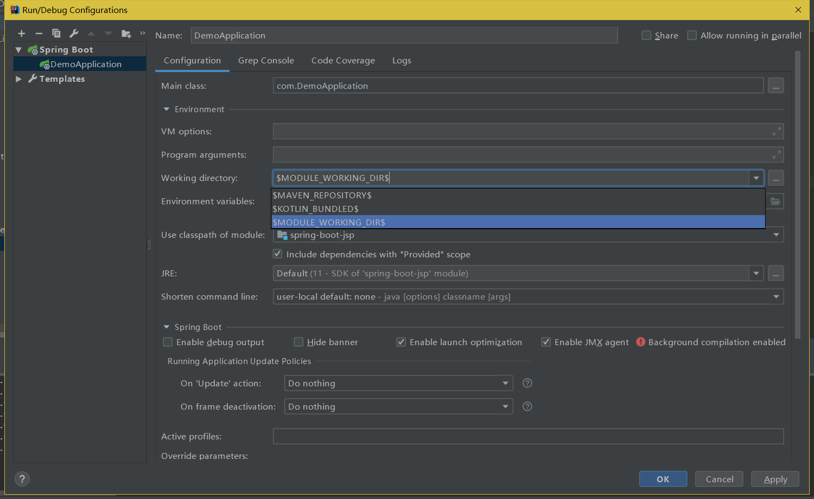
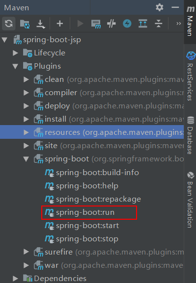

##### 1.增加依赖

```xml
 <!--servlet的支持-->
 <dependency>
     <groupId>javax.servlet</groupId>
     <artifactId>javax.servlet-api</artifactId>
 </dependency>

 <!-- 开启对jsp的支持 -->
 <dependency>
     <groupId>org.apache.tomcat.embed</groupId>
     <artifactId>tomcat-embed-jasper</artifactId>
 </dependency>
 <!--jstl-->
<dependency>
     <groupId>javax.servlet</groupId>
     <artifactId>jstl</artifactId>
 </dependency>
 <!-- Tomcat的支持 -->
 <dependency>
     <groupId>org.springframework.boot</groupId>
     <artifactId>spring-boot-starter-tomcat</artifactId>
     <!--  <scope>provided</scope>-->
 </dependency>
```


##### 2.application.properties

```properties
spring.mvc.view.prefix:WEB-INF/jsp/
spring.mvc.view.suffix:.jsp
```


##### 3.新建文件夹




##### 4.创建IndexController

```java
/**
 * Description:
 * author: LinQin
 * date: 2018/07/03
 */
@Controller
public class Index {

    @RequestMapping("/jsp")
    public String index() {
        System.out.println("进入到jsp");
        return "index";
    }
}
```


##### 5.启动项目

点击run

页面访问：http://localhost:8080/jsp


异常情况：有时我们创建项目是使用model创建的。正常启动还是无法访问到jsp页面。如果main方法所在的项目是maven的子模块项目（如 Main-Parent项目中，包含maven-A子模块，正好main方法就在maven-A 模块中）则main方法运行，无法访问jsp。



解决方法：

1. 设置idea的工作路径。

   

2. 使用maven的插件启动



