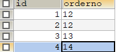

### 重复数据问题

###### 1.表数据



一个表中的orderno有多个记录，把所有这个orderno的记录查出来，并显示共有多少条记录数。

```sql
SELECT orderno,COUNT(1) FROM tmp2 GROUP BY orderno HAVING COUNT(1) >1
```

删除重复数据

- 找出重复的数据订单（可能重复多次）

```sql
SELECT orderno FROM tmp2 GROUP BY orderno HAVING COUNT(1)>1
```

- 去重：查询出重复的其他id，保留一个最小id的订单

```sql
SELECT id FROM tmp2 WHERE orderno IN 
(SELECT orderno FROM tmp2 GROUP BY orderno HAVING COUNT(1)>1) 
AND id NOT IN 
(SELECT MIN(id) FROM tmp2 GROUP BY orderno HAVING COUNT(1)>1)
```

